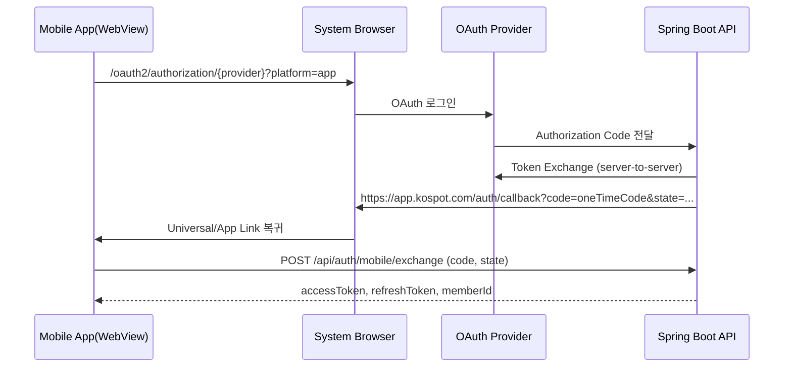

# OAuth2 모바일 플로우 가이드 (KoSpot)

## 1. 목적
- 기존 **웹 전용 OAuth2** 흐름은 유지하면서, Android/iOS 앱(WebView + Capacitor)용 OAuth2 흐름을 안전하게 추가한다.
- 토큰을 URL query에 직접 노출하지 않고, **one-time code 교환 방식**으로 전환한다.
- Spring Boot(EC2)와 Vue 프론트의 구현/배포/운영 기준을 단일 문서로 정리한다.

---

## 2. 적용 범위
- 프론트: `kospot-frontend` (Vue + Capacitor)
- 백엔드: Spring Boot (EC2)
- 대상 인증 공급자: Google, Kakao (기존 웹과 동일)

범위 제외:
- 신규 소셜 공급자 추가
- 회원 모델/권한 모델 구조 변경

---

## 3. 현재 상태 (코드 기준)

### 프론트 반영 상태
- OAuth 시작 URL 생성 로직은 공통화됨: `src/core/auth/oauth.service.js`
- 로그인 진입 분기 구현됨: `src/features/auth/views/LoginView.vue`
- 콜백 화면에서 모바일 exchange + 웹 legacy fallback 처리됨: `src/features/auth/views/OAuthCallbackView.vue`
- 모바일 OAuth 활성 플래그 존재: `VUE_APP_OAUTH_MOBILE_ENABLED`

### 백엔드 전제
- 웹 OAuth2는 이미 운영 중
- 모바일 exchange endpoint는 신규 추가 대상
- 웹 회귀를 위해 기존 웹 callback 계약은 유지

---

## 4. 핵심 원칙
1. **Non-breaking**: 웹 OAuth2 흐름은 절대 깨지지 않아야 한다.
2. **Token in URL 금지**: 모바일은 access/refresh를 URL query로 전달하지 않는다.
3. **Feature Flag 기반 점진 배포**:
   - 프론트: `VUE_APP_OAUTH_MOBILE_ENABLED`
   - 백엔드: `feature.oauth.mobile.enabled`
4. **앱 우선순위**: Universal/App Link 우선, Custom Scheme fallback.

---

## 5. 모바일 OAuth2 플로우 (목표)



---

## 6. 엔드포인트 계약

## 6.1 인가 시작
- `GET /oauth2/authorization/{provider}`
- 모바일 분기 파라미터(권장):
  - `platform=app`
  - `client_type=android|ios`

참고:
- 현재 프론트는 `buildOAuthAuthorizeUrl()`에서 네이티브 + 플래그 ON일 때 위 파라미터를 붙인다.

## 6.2 모바일 토큰 교환
- `POST /api/auth/mobile/exchange`
- 요청 예시:

```json
{
  "code": "otc_xxxxx",
  "state": "opaque-state",
  "platform": "ios"
}
```

- 성공 응답 예시:

```json
{
  "isSuccess": true,
  "result": {
    "accessToken": "...",
    "refreshToken": "...",
    "memberId": 123
  }
}
```

- 실패 코드 가이드:
  - `400`: code 만료/형식 오류/state 불일치
  - `401`: 인증 실패(서명/검증 실패)
  - `409`: 이미 소비된 code
  - `429`: 요청 과다(보호)
  - `500`: 서버 내부 오류

---

## 7. Spring Boot 구현 가이드

## 7.1 구성 요소
- `OAuth2SuccessHandler` (또는 callback 성공 핸들러)
  - `platform=app` 분기 시 one-time code 발급
- `MobileAuthController`
  - `POST /api/auth/mobile/exchange`
- `OneTimeCodeService`
  - code 생성/저장/검증/소비 처리

## 7.2 one-time code 스펙
- 랜덤 길이: 최소 32 bytes
- TTL: 60초
- 1회 사용 후 즉시 폐기
- 저장소: Redis 권장 (없으면 DB 임시 테이블)

## 7.3 state 검증
- authorize 시 state 저장
- exchange 시 state 일치 검증
- 불일치 시 즉시 거절(400/401)

## 7.4 발급 토큰 규격
- 웹/모바일 공통 JWT 스키마 유지
- 최소 포함 필드: `memberId`(또는 `sub` -> member 매핑 가능)

---

## 8. 프론트 구현 가이드 (현재 코드 기준)

## 8.1 로그인 시작
- 파일: `src/features/auth/views/LoginView.vue`
- 로직:
  - 웹: 기존 redirect 유지
  - 앱 + 플래그 ON: `openExternalUrl()`로 시스템 브라우저 오픈

## 8.2 콜백 처리
- 파일: `src/features/auth/views/OAuthCallbackView.vue`
- 처리 우선순위:
  1. `VUE_APP_OAUTH_MOBILE_ENABLED=true` + `code` 존재 + legacy token 미존재 -> mobile exchange
  2. 그 외 -> legacy query token fallback

## 8.3 토큰 저장
- 파일: `src/core/auth/authStorage.service.js`
- 현재 저장소: localStorage
- 향후 앱 보안강화 단계에서 secure storage로 교체 예정

## 8.4 후처리
- 토큰 갱신 서비스 시작
- websocket 연결 시도
- 푸시 권한 허용 상태면 등록 시도
- `/main` 라우팅

---

## 9. 앱 딥링크 구성

## 9.1 우선순위
1. Universal Link(iOS) / App Link(Android)
2. Custom Scheme fallback (`kospot://auth/callback`)

## 9.2 서버 정적 파일
- iOS: `/.well-known/apple-app-site-association`
- Android: `/.well-known/assetlinks.json`

## 9.3 프론트 수신 처리
- 파일: `src/core/platform/deeplink.service.js`
- `resolveDeepLinkTarget()`로 경로를 `/login/oauth2/callback?code=...`로 변환

---

## 10. Feature Flag 운영 전략

## 10.1 기본값
- 프론트: `VUE_APP_OAUTH_MOBILE_ENABLED=false`
- 백엔드: `feature.oauth.mobile.enabled=false`

## 10.2 단계별 활성화
1. 서버 코드를 먼저 배포 (flag OFF)
2. 웹 회귀 확인
3. 내부 앱에서 프론트/백엔드 flag 동시 ON
4. 소규모 사용자 검증
5. 전체 활성화

---

## 11. 오류 처리 매트릭스

| 구간 | 오류 | 사용자 처리 | 로그/운영 처리 |
|---|---|---|---|
| authorize 시작 | provider 접근 실패 | "로그인 페이지로 돌아가기" 안내 | provider별 실패 카운트 |
| callback 수신 | code 없음 | 로그인 페이지 복귀 | 콜백 파라미터 로그(민감값 제외) |
| exchange | code 만료 | 재로그인 유도 | 만료율 지표 |
| exchange | state 불일치 | 보안 경고 후 재로그인 | 보안 경보 |
| exchange | 5xx | 잠시 후 재시도 안내 | error 알람 |

---

## 12. 테스트 시나리오

## 12.1 기능
- [ ] Android 앱 로그인 성공
- [ ] iOS 앱 로그인 성공
- [ ] 로그인 취소 시 정상 복귀
- [ ] code 재사용 시 409
- [ ] code 만료(60초 초과) 시 재로그인 유도

## 12.2 회귀
- [ ] 웹 OAuth2 성공/실패/취소
- [ ] 웹 전용 기능 접근 권한 회귀 없음

## 12.3 보안
- [ ] URL에 access/refresh token 노출 없음
- [ ] state mismatch 차단
- [ ] exchange endpoint rate-limit 동작

---

## 13. 배포 체크리스트
- [ ] OAuth 공급자 콘솔에 앱 redirect URI 등록
- [ ] App Links/Universal Links 도메인 검증 완료
- [ ] 프론트/백엔드 flag 기본값 OFF로 배포
- [ ] 내부 테스트 계정으로 E2E 검증
- [ ] 운영 모니터링 대시보드(성공률/실패사유) 확인

---

## 14. 롤백 전략
- 장애 시 즉시 `feature.oauth.mobile.enabled=false`
- 프론트 `VUE_APP_OAUTH_MOBILE_ENABLED=false` 재배포
- 앱에서는 legacy 웹 OAuth fallback 사용

---

## 15. 향후 개선
1. 앱 토큰 저장소를 secure storage로 전환
2. mobile exchange 요청에 device fingerprint 보강
3. OAuth provider별 위험 점수/차단 정책 도입
4. E2E 자동화 테스트(CI) 추가
