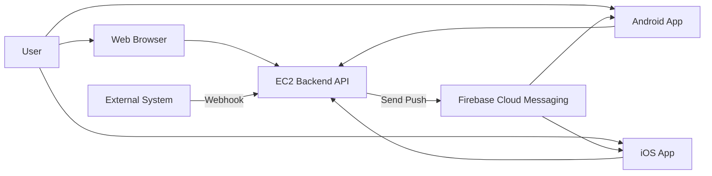
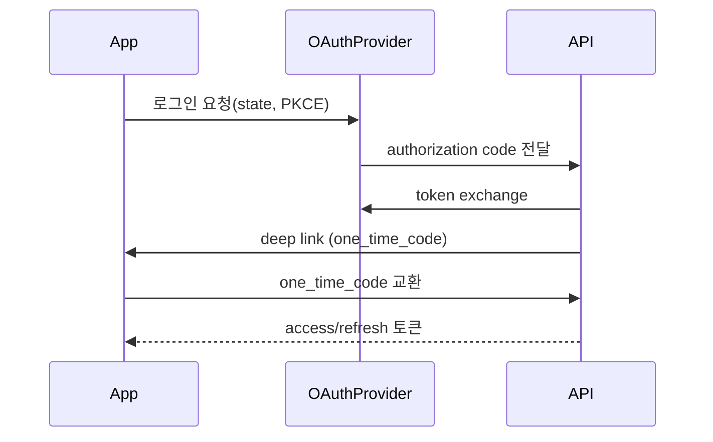

# KoSpot Web + App 통합 출시 마스터 플랜

## 0) 문서 목적

이 문서는 현재 S3에 배포 중인 KoSpot Vue 프론트엔드를 기반으로,

- Web(기존) + Android + iOS를 단일 코드베이스로 운영하고
- 모바일 전용 기능인 푸시 알림 설정(수신 동의/해지)을 제공하며
- 서버사이드(웹훅/푸시/OAuth2/환경변수)까지 실무 수준으로 반영하기 위한

사전 설계 및 실행 계획서입니다.

---

## 1) 현재 상태 요약

### 확인된 전제

1. 프론트엔드는 Vue 3 기반이며 이미 반응형 대응 완료.
2. 웹 배포는 S3(+선택적으로 CloudFront) 기반 자동화가 존재.
3. 인증은 OAuth2 사용 중.
4. 백엔드는 EC2에 운영 중이며 API/WS를 제공.
5. 백엔드(Spring Boot)에는 웹 전용 OAuth2 및 웹 전용 기능이 이미 운영 중이며, 모바일 OAuth2는 미구현 상태.

### 코드 관점 핵심 포인트

- OAuth 콜백 경로: `/login/oauth2/callback` (`src/router/mainRoutes.js`)
- 로그인 리다이렉트: `window.location.href` 기반 (`src/features/auth/views/LoginView.vue`)
- 콜백에서 query로 토큰 처리 (`src/features/auth/views/OAuthCallbackView.vue`)
- API baseURL은 `VUE_APP_API_BASE_URL` (`src/core/api/apiClient.js`)
- 환경변수는 `KoSpot-frontend-private` 서브모듈로 관리 (`docs/ENVIRONMENT_SETUP.md`)

---

## 2) 최종 목표(Definition of Success)

### 제품 목표

- 동일 기능의 Web + Android + iOS 동시 운영
- 모바일 앱에서 푸시 알림 수신 여부를 사용자 설정으로 제어
- 외부 시스템에서 웹훅 호출 시 대상 유저에게 안정적으로 푸시 발송

### 기술 목표

- 프론트엔드 코드베이스 단일화(웹/앱 공용)
- 플랫폼별 차이(딥링크, 푸시 권한, OAuth 복귀)만 분기 처리
- 보안 수준 강화(서명 검증, 토큰 저장 정책, 재전송 방지)

### 운영 목표

- 웹 배포(S3)와 앱 배포(스토어) 파이프라인 분리
- 장애 대응 가능한 로그/모니터링/알림 체계 구축

---

## 3) 권장 기술 스택

### 프론트/앱

- Vue 3 (기존 유지)
- Capacitor
  - `@capacitor/core`
  - `@capacitor/cli`
  - `@capacitor/android`
  - `@capacitor/ios`
  - `@capacitor/push-notifications`
  - `@capacitor/preferences` (설정 캐시)
  - `@capacitor/app` (앱 lifecycle/deeplink)
  - `@capacitor/browser` (외부 OAuth 오픈)

### 푸시

- FCM 단일화
  - Android: FCM direct
  - iOS: APNs 연동을 FCM 경유

### 백엔드

- 기존 EC2 API 서버 확장
- 웹훅 수신 API + HMAC 검증 + Idempotency
- 디바이스 토큰 관리 API + FCM 발송 서비스

### 배포

- Web: 기존 S3 배포 유지
- App: GitHub Actions(선택) + 로컬/CI 서명 빌드 + Play Console/TestFlight

---

## 4) 목표 아키텍처



핵심 원칙:

- Web/App 모두 동일 API 사용
- App만 푸시 토큰 등록 및 권한 관리 수행
- 외부 이벤트는 웹훅으로 유입되어 내부 정책 기반 발송

---

## 5) 작업 스트림(Workstreams)

## WS-1. 모바일 앱 셸(Capacitor) 도입

### 목표

웹 산출물(`dist`)을 Android/iOS 네이티브 컨테이너로 빌드 가능하게 구성.

### 주요 작업

1. Capacitor 초기화 및 플랫폼 추가
2. `webDir=dist` 설정
3. 앱 스킴/번들ID/앱 이름/아이콘/스플래시 정의
4. `npm run build:prod` -> `npx cap sync` 통합 스크립트 추가

### 산출물

- `capacitor.config.*`
- `android/`, `ios/` 네이티브 프로젝트
- 앱 빌드 실행 가이드 문서

---

## WS-2. OAuth2 모바일 호환 설계

### 문제 인식

현재는 브라우저 리다이렉트 + query token 전달 방식으로 구현되어 있어,
모바일 앱(WebView)에서는 복귀 제어 및 보안(토큰 노출) 측면 개선이 필요.

### 권장 설계

#### 1) 인증 시작

- 앱에서 OAuth 시작 시 `Capacitor Browser` 또는 시스템 브라우저 사용
- `state`, `code_challenge(PKCE)` 사용

#### 2) 인증 완료 복귀

- 백엔드 콜백 성공 후 앱 딥링크로 복귀
  - 예: `kospot://auth/callback?code=one_time_code&state=...`

#### 3) 토큰 교환

- 앱이 `one_time_code`를 백엔드에 전달하고 access/refresh 토큰 교환
- query에 access/refresh 직접 노출 금지

### 시퀀스



### 백엔드 반영

- 모바일 OAuth 완료용 endpoint
- 일회용 코드 TTL(예: 60초)
- 코드 1회 사용 후 즉시 폐기

---

## WS-3. 푸시 알림 설정 기능(모바일 전용)

### 기능 요구

1. 앱 최초 실행 또는 설정 화면에서 알림 권한 요청
2. 사용자가 앱 내에서 알림 수신 ON/OFF 가능
3. 수신 OFF 시 서버 발송 대상에서 제외

### UX 정책

- 첫 실행 즉시 권한 팝업 강제 금지
- 설정 화면에서 목적 설명 후 권한 요청
- OS 권한 거부 시 시스템 설정 이동 버튼 제공

### 프론트 데이터 모델

- local 설정(캐시): `push.enabled.local`
- 서버 설정(권위 데이터): `push.enabled.server`
- 실발송 여부: `server == true && token active == true`

### 동작 규칙

1. 로그인 성공 시 token 등록 시도
2. 사용자가 OFF하면 서버에 `enabled=false` 반영
3. 로그아웃 시 토큰 비활성화(또는 user unlink)
4. 토큰 갱신 발생 시 upsert

---

## WS-4. 백엔드 서버사이드 로직 반영

## 4-1. 디바이스 토큰 관리 API

### API 초안

- `POST /api/mobile/push-tokens`
  - body: `token`, `platform(android|ios)`, `appVersion`, `deviceId`, `enabled`
- `PATCH /api/mobile/push-tokens/{token}`
  - body: `enabled`
- `DELETE /api/mobile/push-tokens/{token}`

### DB 모델 예시

`mobile_push_tokens`

- `id` (PK)
- `member_id` (FK)
- `platform`
- `token` (unique)
- `enabled` (bool)
- `last_seen_at`
- `app_version`
- `device_id`
- `created_at`, `updated_at`

인덱스:

- `(member_id, enabled)`
- `(token unique)`

## 4-2. 웹훅 인바운드 API

### API 초안

- `POST /api/webhooks/notify`
- Header:
  - `X-Signature: sha256=...`
  - `X-Timestamp: <unix epoch>`
  - `X-Event-Id: <unique id>`

### 검증 규칙

1. timestamp 오차 5분 이내
2. signature 검증 실패 시 401
3. event id 중복 시 200(ignore) 또는 409

### Payload 예시

```json
{
  "eventType": "NOTICE",
  "target": {
    "type": "users",
    "userIds": [101, 205]
  },
  "title": "새 공지",
  "body": "업데이트 내용을 확인하세요.",
  "deeplink": "/notice/123",
  "priority": "high",
  "metadata": {
    "source": "admin-console"
  }
}
```

## 4-3. 발송 파이프라인

1. 웹훅 수신 -> 검증
2. 대상 사용자 계산
3. 유효 토큰 조회(`enabled=true`)
4. FCM 멀티캐스트 전송
5. 실패 코드별 처리
   - `UNREGISTERED` -> 토큰 비활성화
   - `INVALID_ARGUMENT` -> 포맷 점검 + 비활성화 검토
6. 로그 저장 + 재시도 큐 적재

## 4-4. 관측성

- 로그 테이블: `push_delivery_logs`
- 지표: 요청 수, 성공률, 토큰 무효율, 평균 지연(ms)
- 알람: 성공률 급감, 웹훅 검증 실패율 급증

---

## WS-5. 환경변수/시크릿 관리 가이드

현재 서브모듈 기반 환경변수 전략은 유지하되, Web/App/Server를 분리하여 관리.

## 5-1. 분류 원칙

- `public env` (프론트 번들 포함 가능): API endpoint, 앱 스킴, feature flag
- `secret env` (절대 프론트 포함 금지): webhook secret, FCM server key, OAuth client secret

## 5-2. 프론트 환경변수(예시)

| Key | 용도 | 공개 여부 |
|---|---|---|
| `VUE_APP_API_BASE_URL` | API base URL | 공개 가능 |
| `VUE_APP_WS_URL` | WebSocket URL | 공개 가능 |
| `VUE_APP_OAUTH_REDIRECT_WEB` | 웹 리다이렉트 URL | 공개 가능 |
| `VUE_APP_OAUTH_REDIRECT_APP` | 앱 딥링크 URL | 공개 가능 |
| `VUE_APP_APP_SCHEME` | 딥링크 스킴 | 공개 가능 |
| `VUE_APP_ENABLE_PUSH` | 푸시 기능 플래그 | 공개 가능 |

## 5-3. 백엔드 시크릿(예시)

| Key | 용도 |
|---|---|
| `WEBHOOK_HMAC_SECRET` | 웹훅 서명 검증 |
| `FCM_SERVICE_ACCOUNT_JSON` | FCM 발송 인증 |
| `OAUTH_*_CLIENT_SECRET` | OAuth 토큰 교환 |
| `JWT_SIGNING_KEY` | JWT 서명 |

## 5-4. 환경 매트릭스

- `development`
- `staging`
- `production`

각 환경마다 아래를 분리:

1. API 도메인
2. OAuth redirect URI
3. 딥링크/앱링크 설정
4. FCM 프로젝트
5. 웹훅 shared secret

## 5-5. 저장소/CI 관리 원칙

- 프론트 공개값: 기존 `KoSpot-frontend-private`에서 관리
- 백엔드 시크릿: EC2 Parameter Store/Secrets Manager 권장
- GitHub Actions: repo secrets는 최소 권한만 부여
- 인증서/키스토어는 base64 암호화 후 CI에서 복호화 사용

---

## WS-6. 웹 배포(S3) + 앱 배포(스토어) 동시 운영 전략

## 6-1. 브랜치 전략

- `main`: production
- `staging`: staging
- `feature/*`: 기능 개발

## 6-2. 파이프라인 분리

1. Web 파이프라인
   - build -> lint/test -> S3 sync -> CloudFront invalidation
2. App 파이프라인
   - build web assets -> cap sync -> native build(sign) -> internal distribution

## 6-3. 버전 관리

- 웹 버전: `app_version` (UI footer/diagnostics 표시)
- 앱 버전: Android `versionCode/versionName`, iOS `build/version`
- API 최소 지원 앱 버전 정책 추가(`min_supported_app_version`)

---

## WS-7. 프론트 코드 변경 가이드(실제 구현 시 적용)

1. 플랫폼 감지 유틸 공통화
   - Web/Android/iOS 분기 함수
2. 라우팅 일관성 강화
   - `window.location.href` 직접 이동을 점진적으로 router 기반으로 치환
3. OAuth 모듈화
   - 웹/앱 로그인 시작 함수 분리
   - 콜백 파서 공통화
4. Push 모듈화
   - 권한 요청
   - 토큰 등록/갱신
   - 알림 클릭 시 라우팅
5. 설정 UI 추가
   - `알림 받기` 토글
   - OS 권한 상태 배지

---

## WS-8. 보안/컴플라이언스 체크리스트

- [ ] OAuth state/nonce 검증
- [ ] PKCE 적용
- [ ] 앱 딥링크 도메인 검증(Universal Links/App Links)
- [ ] 웹훅 HMAC 검증 + replay 공격 방지
- [ ] 토큰 저장 정책 점검(localStorage 사용 구간 최소화)
- [ ] 로그에 PII/토큰 마스킹
- [ ] iOS App Review 대응(앱 고유 기능 명시: 푸시, 딥링크, 알림 설정)

---

## WS-9. 테스트 계획

## 9-1. 기능 테스트

- 로그인(웹/앱)
- OAuth 복귀(성공/실패/취소)
- API 인증 만료 후 재발급
- 푸시 수신(포그라운드/백그라운드/종료)
- 알림 토글 ON/OFF 즉시 반영
- 웹훅 호출 후 대상 수신 검증

## 9-2. 회귀 테스트

- 기존 반응형 UI
- WebSocket 주요 시나리오
- S3 배포 후 캐시 무효화 검증

## 9-3. 스토어 전 검증

- Android 3종 단말
- iOS 2종 단말
- 네트워크 전환(Wi-Fi/LTE)
- 앱 kill/relaunch 시 세션 복원

---

## WS-10. 릴리즈 단계별 실행 계획

## Phase 1: 설계/기반 (1주)

- 아키텍처 확정
- OAuth/Push/Webhook API 명세 확정
- 환경변수 키셋 확정

## Phase 2: 앱화/인증 (1~2주)

- Capacitor 도입
- OAuth 모바일 플로우 반영
- 딥링크 라우팅 연결

## Phase 3: 푸시/웹훅 (1~2주)

- 토큰 API + 알림 설정 UI
- 웹훅 검증/발송 파이프라인
- 실패 재시도 및 로깅

## Phase 4: QA/배포 (1주)

- 내부 테스트 배포
- 버그픽스/성능보정
- Play/TestFlight 제출

---

## 11) 리스크와 대응

1. OAuth 복귀 실패
   - 대응: deep link + universal/app link 동시 지원, fallback web callback
2. iOS 푸시 전달률 이슈
   - 대응: APNs key/entitlement 점검, foreground handler 검증
3. 토큰 누락/만료
   - 대응: 앱 실행 시 재등록, 실패코드별 정리 job 운영
4. 웹과 앱 릴리즈 불일치
   - 대응: API 호환 버전 계약, feature flag 기반 점진 활성화

---

## 12) 완료 기준(Exit Criteria)

- [ ] Web 배포 파이프라인 영향 없이 앱 빌드 가능
- [ ] Android/iOS에서 OAuth 로그인 정상 완료
- [ ] 앱 내 알림 설정 ON/OFF가 서버 발송에 즉시 반영
- [ ] 웹훅 호출부터 실제 푸시 수신까지 E2E 검증 통과
- [ ] 운영 대시보드에서 발송 성공률/실패 원인 확인 가능
- [ ] 스토어 내부 배포(Internal/TestFlight) 완료

---

## 13) 구현 시작 전 확정해야 할 항목(Checkpoint)

1. 앱 번들 ID / 패키지명 / 앱 이름
2. OAuth 공급자별 모바일 redirect URI 등록
3. FCM 프로젝트(환경별) 분리 여부
4. 웹훅 호출 주체(어드민/외부시스템)와 secret 배포 방식
5. 푸시 대상 정책(전체, 세그먼트, 개인) 우선순위

이 5개를 확정하면 대규모 패치를 안정적으로 시작할 수 있습니다.

---

## 14) 사전 점검 결과 (배포 전 필수 보완)

본 계획은 방향성은 적절하나, 실제 스토어 출시/운영 관점에서 아래 항목을 반드시 보완해야 합니다.

### A. 빠진 항목 (Must Have)

1. HTTPS/도메인 전제 명시 누락
   - Universal Links(iOS) / App Links(Android), OAuth redirect, 웹훅 호출 신뢰성 모두 HTTPS 고정 도메인이 필요.
   - S3 Website Endpoint 단독 운영은 권장하지 않음. CloudFront + ACM + 커스텀 도메인 전제 필요.

2. iOS 심사 핵심 정책 누락
   - 서드파티 로그인 제공 시 `Sign in with Apple` 요구 가능성이 높음.
   - 개인정보처리방침 URL, 계정 삭제 경로, 데이터 수집 항목(App Privacy) 준비 필요.

3. Android 13+/iOS 권한 세부 요건 누락
   - Android: `POST_NOTIFICATIONS` 런타임 권한.
   - iOS: Push entitlement, Background Modes(remote-notification), 권한 문구 정합성.

4. CORS/Origin 정책 누락
   - 백엔드는 앱 origin(`capacitor://localhost`, `http://localhost`) 허용 정책을 명시해야 함.
   - 웹 origin과 앱 origin을 분리하여 허용 목록 관리 필요.

5. 운영 안정성(큐) 누락
   - 웹훅 요청 경로에서 즉시 FCM 발송은 timeout/재시도 한계가 큼.
   - 웹훅 수신은 `enqueue`까지만 처리하고, 비동기 워커가 발송해야 함.

6. 강제 업데이트/최소 지원 버전 실행 규칙 누락
   - `min_supported_app_version` 정의만 있고 실제 차단 정책(soft/hard block)이 없음.

### B. 모호한 부분 (Needs Clarification)

1. 푸시 SDK 선택 기준 모호
   - `@capacitor/push-notifications` 단독인지, `@capacitor-firebase/messaging`로 FCM 토큰 통일할지 결정 필요.
   - 권장: FCM 통일 운영이 목적이면 `@capacitor-firebase/messaging` 우선 검토.

2. OAuth 복귀 방식 우선순위 모호
   - Custom Scheme와 Universal/App Link를 모두 언급했으나 우선순위가 없음.
   - 권장: Universal/App Link 우선, Custom Scheme fallback.

3. 토큰 저장 위치 모호
   - 문서는 localStorage 최소화를 말하지만 대체 저장소 미정.
   - 권장: 민감 토큰은 secure storage(Keychain/EncryptedSharedPreferences) 사용.

4. 웹/앱 빌드 모드 분리 전략 모호
   - 앱은 devServer proxy가 없으므로 항상 절대 API URL이 필요.
   - `production-web`, `production-app` 환경을 분리해야 혼선 방지 가능.

5. 웹훅 중복 처리 정책 모호
   - 중복 event 처리 응답이 `200 또는 409`로 열려 있음.
   - 권장: 일관되게 `202 Accepted` + 내부에서 dedupe 처리.

### C. 이상하거나 리스크가 큰 부분 (Risky)

1. OAuth query token 전달 관행
   - 현재 코드 패턴(쿼리 토큰)은 referrer/log 노출 위험이 높음.
   - 반드시 one-time code 교환으로 전환 필요.

2. 토큰 테이블 unique 전략 단순화
   - `token unique` 단일 제약은 멀티 계정/재로그인/기기 교체 시 충돌 가능.
   - `token + app_id + platform` 또는 upsert 정책을 명시해야 함.

3. 웹훅 보안에서 rate limit/IP allowlist 누락
   - HMAC만으로는 abuse 트래픽을 완전히 방어하기 어려움.
   - IP allowlist + rate limit + WAF 규칙 필요.

4. 장애 대응 Runbook 누락
   - FCM 장애/인증서 만료/APNs 키 오류 시 운영 절차가 없음.

---

## 15) 보완 후 확정안 (실행 기준)

### 15-1. 아키텍처/배포 확정

- Web: S3 + CloudFront + HTTPS 커스텀 도메인 필수
- App: Capacitor + FCM + 딥링크(Universal/App Link 우선)
- Backend: Webhook Inbound -> Queue -> Push Worker

### 15-2. OAuth2 확정

- 앱 로그인은 시스템 브라우저 기반
- 콜백은 Universal/App Link 우선
- access/refresh 토큰 query 전달 금지
- one-time code(60s TTL, 1회성) 교환 필수

### 15-3. 푸시/토큰 확정

- 토큰 upsert API 정의(중복/갱신 포함)
- 앱 설정 ON/OFF는 서버 플래그를 source of truth로 사용
- Android notification channel(importance)와 iOS category/action 명시

### 15-4. 보안/운영 확정

- CORS origin 분리(web/app)
- 웹훅: HMAC + timestamp + nonce/event dedupe + rate limit + IP allowlist
- 발송 실패 코드 자동 정리 job(UNREGISTERED 정리)
- 대시보드: 성공률/지연/실패코드/환경별 분리

---

## 16) 구현 착수 전 체크리스트 (Gate)

- [ ] 도메인/인증서/CloudFront 확정(Universal/App Link 파일 호스팅 가능)
- [ ] OAuth 공급자 콘솔에 Web/App redirect URI 등록 완료
- [ ] iOS Apple 로그인 필요 여부 법무/정책 검토 완료
- [ ] FCM 프로젝트/키(dev,stg,prod) 분리 및 키 배포 경로 확정
- [ ] CORS 허용 origin 목록 확정
- [ ] 웹훅 secret 배포/회전 정책 확정(주기, 롤백 절차 포함)
- [ ] 앱 서명키/프로비저닝/비밀관리(Secrets Manager) 준비 완료

이 Gate를 통과하면 대규모 패치 착수 시 재작업 리스크를 크게 줄일 수 있습니다.

---

## 17) EC2 + Spring Boot 기준 재점검 (확정 반영)

서버가 EC2에 배포된 Spring Boot라는 전제를 기준으로, 아래 항목을 구현 기준으로 고정합니다.

### 17-1. Spring Boot 서버 구조 권장안

- App 계층: `Controller -> Service -> Repository`
- 비동기 발송 계층: `Webhook Inbound -> Outbox(or Queue) -> Push Worker`
- 운영 계층: `Actuator + Metrics + Log Aggregation`

권장 패키지 경계:

1. `auth` (OAuth2, token exchange, one-time code)
2. `push` (token API, FCM sender, delivery log)
3. `webhook` (signature verify, dedupe, enqueue)
4. `ops` (health, metrics, admin tools)

### 17-2. Spring Boot 의존성 체크리스트

- `spring-boot-starter-web`
- `spring-boot-starter-security`
- `spring-boot-starter-validation`
- `spring-boot-starter-data-jpa`
- `spring-boot-starter-actuator`
- `firebase-admin` (FCM 발송)
- `micrometer-registry-prometheus` (지표)

선택:

- `resilience4j-spring-boot3` (retry/circuit breaker)
- `spring-cloud-starter-aws-parameter-store-config` (Parameter Store 연동)

### 17-3. 보안 설정(Spring Security) 확정

#### CORS

- 웹 origin과 앱 origin을 명시적으로 분리 관리
- 허용 예시:
  - `https://kospot.com`
  - `https://www.kospot.com`
  - `capacitor://localhost`
  - `http://localhost` (Capacitor Android WebView)

#### Webhook 인증

- `X-Signature`, `X-Timestamp`, `X-Event-Id` 강제
- 서버 시계 오차 허용 5분
- HMAC SHA-256 검증 실패 즉시 401
- 중복 이벤트는 DB/Redis dedupe key로 방어

#### 인증 토큰

- 모바일 OAuth 완료 시 one-time code만 앱으로 전달
- access/refresh token을 URL query로 노출 금지

### 17-4. 데이터 모델 확정(수정)

`mobile_push_tokens` 권장 컬럼:

- `id` PK
- `member_id` FK
- `app_id` (패키지/번들 구분)
- `platform` (`android`, `ios`)
- `token`
- `enabled`
- `permission_status` (`granted`, `denied`, `prompt`)
- `last_seen_at`
- `created_at`, `updated_at`

권장 인덱스/제약:

- unique(`app_id`, `platform`, `token`)
- index(`member_id`, `enabled`)
- index(`updated_at`)

`push_delivery_logs` 권장 컬럼:

- `event_id`
- `member_id`
- `token`
- `status` (`SUCCESS`, `FAILED`, `DROPPED`)
- `provider_code` (FCM 에러 코드)
- `latency_ms`
- `created_at`

### 17-5. 웹훅 처리 방식 확정

EC2 단일/소수 인스턴스 기준 실무 권장:

1. 1차: DB Outbox 패턴 (추가 인프라 최소)
2. 확장 시: SQS 도입으로 Inbound/Worker 분리

처리 절차:

1. Inbound API는 검증 후 Outbox insert
2. 즉시 `202 Accepted` 반환
3. Worker가 배치 polling하여 FCM 발송
4. 실패 건 retry backoff
5. retry 초과 시 DLQ 테이블로 이관

### 17-6. FCM 발송 정책(Spring Service)

- 배치 전송 단위(예: 500)
- 실패 코드별 처리 정책 고정
  - `UNREGISTERED` -> token 비활성화
  - `INVALID_ARGUMENT` -> token 포맷 검증 후 비활성화 후보
  - `UNAVAILABLE` -> 재시도
- `notification + data` payload 분리 설계
- 딥링크는 `data.deeplink`로 전달

### 17-7. EC2 운영 체크

- Nginx/ALB 뒤에서 TLS 종료 (HTTPS 강제)
- Spring Boot는 private subnet/보안그룹 최소 허용
- 시간 동기화(NTP) 필수 (웹훅 timestamp 검증 영향)
- 로그 로테이션 및 보존 기간 정책
- Blue/Green 또는 Rolling 배포 전략 명시

---

## 18) OAuth2 (Spring Boot) 상세 가이드

### 18-1. 서버 엔드포인트 권장안

- `GET /api/auth/oauth2/authorize/{provider}`
  - 웹/앱 공통 진입점
  - 앱 요청이면 `state`에 `platform=app` 포함
- `GET /login/oauth2/code/{provider}`
  - Spring Security OAuth2 callback
- `POST /api/auth/mobile/exchange`
  - one-time code -> JWT 토큰 교환

호환성 원칙:

- 기존 웹 OAuth2 엔드포인트/동작은 유지(Non-breaking).
- 모바일 OAuth2는 신규 endpoint/분기 로직으로 추가(웹 플로우와 분리).
- 웹/모바일 공통으로 최종 JWT 발급 규격(`accessToken`, `refreshToken`, `memberId`)은 동일 유지.

### 18-2. one-time code 스펙

- 길이: 최소 32 bytes random
- TTL: 60초
- 1회 사용 즉시 폐기
- Redis 또는 DB 임시 저장

### 18-3. 리다이렉트 규칙

- Web: `https://kospot.com/login/oauth2/callback?code=...`
- App: `https://app.kospot.com/auth/callback?code=...` (Universal/App Link)
- Fallback: `kospot://auth/callback?code=...`

주의:

- 앱 링크 도메인은 iOS `apple-app-site-association`, Android `assetlinks.json` 제공 필요

---

## 19) 환경변수 관리 (Spring Boot + EC2) 확정 키셋

### 19-1. Spring Boot 필수 키

- `SPRING_PROFILES_ACTIVE`
- `SERVER_PORT`
- `CORS_ALLOWED_ORIGINS`
- `JWT_SIGNING_KEY`
- `WEBHOOK_HMAC_SECRET`
- `FCM_PROJECT_ID`
- `FCM_SERVICE_ACCOUNT_JSON` 또는 `GOOGLE_APPLICATION_CREDENTIALS`
- `OAUTH_KAKAO_CLIENT_ID`
- `OAUTH_KAKAO_CLIENT_SECRET`
- `OAUTH_GOOGLE_CLIENT_ID`
- `OAUTH_GOOGLE_CLIENT_SECRET`

### 19-2. 권장 주입 방식

1. 민감값: AWS Systems Manager Parameter Store(또는 Secrets Manager)
2. EC2 런타임: IAM Role로 조회 권한 부여
3. 앱 기동 시 환경 변수/프로퍼티 바인딩

### 19-3. 회전(Rotation) 정책

- `WEBHOOK_HMAC_SECRET`: 분기 1회
- OAuth client secret: 공급자 정책 주기
- JWT signing key: 반기 1회(키 롤링 전략 포함)
- FCM service account key: 분기 1회 검토

---

## 20) 최종 재점검 결론

### 결론

- 현재 계획은 실행 가능한 수준이며, EC2 + Spring Boot 운영 전제에도 부합.
- 다만 실제 성공 여부는 `Queue/Outbox`, `OAuth one-time code`, `CORS 분리`, `스토어 심사 대응` 4개 축의 완성도에 달려 있음.

### 즉시 착수 우선순위

1. Spring Boot 웹훅/푸시 API 스펙 고정 (응답코드 포함)
2. OAuth 모바일 교환 방식(one-time code) 서버 구현
3. 모바일 토큰 API + 설정 ON/OFF 서버 반영
4. CloudFront 커스텀 도메인 + 앱 링크 파일 배포
5. 내부 배포(테스트)로 E2E 검증

---

## 21) 핵심 코드 재스캔 결과 (실제 코드 기준)

아래 내용은 현재 프론트 코드 핵심 파일을 재확인한 결과이며, 구현 우선순위에 직접 반영합니다.

### 21-1. 인증/OAuth

- `src/features/auth/views/LoginView.vue`
  - OAuth 시작 URL을 `VUE_APP_API_BASE_URL + /oauth2/authorization/{provider}`로 생성 중.
  - 기본값 문자열이 `http:localhost:8080/api` 형태로 잘못되어 있음(스킴 오타).
  - 앱 전환 시에는 `window.location.href` 대신 브라우저 플러그인/딥링크 방식 필요.

- `src/features/auth/views/OAuthCallbackView.vue`
  - `accessToken`, `refreshToken`을 query에서 직접 파싱하여 localStorage 저장.
  - 모바일/보안 기준에서 one-time code 교환 방식으로 전환 필수.

### 21-2. 토큰 저장/갱신

- `src/core/services/tokenRefresh.service.js`, `src/core/api/apiClient.js`, `src/core/composables/useAuth.js`
  - localStorage 접근이 광범위하며 강제 이동(`window.location.href`) 로직이 존재.
  - 앱(WebView) 안정성을 위해 공통 auth storage abstraction + router 기반 이동으로 단계적 전환 필요.

### 21-3. 라우팅/딥링크

- `src/router/index.js`
  - `createWebHistory(process.env.VUE_APP_BASE_URL)` 사용.
  - 딥링크 유입 처리(`appUrlOpen`/딥링크 파서) 없음.

### 21-4. WebSocket

- `src/core/services/notificationWebSocket.service.js`
  - `VUE_APP_WS_URL` 대신 `VUE_APP_API_BASE_URL + /ws` 조합을 사용.
  - API base가 `/api`를 포함하면 WS endpoint가 왜곡될 수 있어 환경 분리 필요.

- `src/features/friend/services/friendWebSocket.service.js`
  - 동일하게 API base 기반으로 WS URL 구성 중.

### 21-5. 배포/빌드

- `.github/workflows/deploy.yml`
  - 현재 Web(S3) 배포 전용 파이프라인.
  - 앱 빌드/서명/스토어 배포 파이프라인은 없음.

- `package.json`, `README.md`
  - README는 Vite 표기를 포함하지만 실제 스크립트는 Vue CLI(`vue-cli-service`) 기반.
  - 문서/실행체계 불일치 해소 필요.

- `public/index.html`
  - Kakao SDK/광고 관련 스크립트가 전역 로드됨.
  - 앱(WebView)에서는 불필요/심사 리스크 요소를 feature flag로 분리 로드 필요.

---

## 22) 파일 단위 구체 수정 계획 (프론트)

아래는 실제 패치 시 변경 대상 파일과 변경 내용을 1:1로 매핑한 작업 목록입니다.

### 22-1. 모바일 플랫폼/런타임 유틸 추가

신규 파일:

1. `src/core/platform/runtime.ts` 또는 `src/core/platform/runtime.js`
   - `isNativeApp`, `isAndroidApp`, `isIosApp`, `isWeb` 제공
2. `src/core/platform/deeplink.service.ts`
   - 앱 URL 오픈 이벤트 파싱
   - `/auth/callback`, `/notice/:id` 라우팅 변환
3. `src/core/platform/push.service.ts`
   - 권한 확인/요청
   - 토큰 조회/갱신
   - 서버 토큰 등록 API 연동

### 22-2. 인증 경로 정리

수정 파일:

1. `src/features/auth/views/LoginView.vue`
   - OAuth URL 생성 로직을 공통 auth service로 이동
   - 앱에서는 external browser + 딥링크 복귀 사용
2. `src/features/auth/views/OAuthCallbackView.vue`
   - query 토큰 파싱 제거
   - one-time code 교환 API 호출로 변경
3. `src/core/composables/useAuth.js`
   - 토큰 저장/삭제 로직을 auth storage 모듈 사용으로 통일

### 22-3. 라우팅/강제 이동 제거

수정 파일:

1. `src/router/index.js`
   - 앱 딥링크 초기 진입 처리 훅 연결
2. `src/core/api/apiClient.js`
3. `src/core/services/tokenRefresh.service.js`
   - `window.location.href` 의존을 router fallback 정책으로 교체

### 22-4. WebSocket URL 정규화

수정 파일:

1. `src/core/services/notificationWebSocket.service.js`
2. `src/features/friend/services/friendWebSocket.service.js`

변경 규칙:

- WS endpoint는 반드시 `VUE_APP_WS_URL` 기준으로 생성
- `VUE_APP_API_BASE_URL`과 혼용 금지

### 22-5. 환경변수/문서 정합성

수정 파일:

1. `config/env.template`
2. `docs/ENVIRONMENT_SETUP.md`
3. `README.md`
4. `public/index.html`

변경 내용:

- `web`, `app` 환경 키 명확 분리
- Vue CLI 기준으로 문서 통일
- OAuth/WS/push 관련 키셋 추가
- 앱 타겟(`VUE_APP_PLATFORM_TARGET=app`)일 때 광고/불필요 스크립트 비활성화

---

## 23) Spring Boot API 계약 구체화 (서버 구현 바로 가능 수준)

### 23-1. 모바일 OAuth 교환 API

- `POST /api/auth/mobile/exchange`
- request:

```json
{
  "code": "one-time-code",
  "state": "opaque-state",
  "platform": "ios"
}
```

- response:

```json
{
  "isSuccess": true,
  "result": {
    "accessToken": "...",
    "refreshToken": "...",
    "memberId": 123
  }
}
```

- 실패 코드:
  - `400` invalid/expired code
  - `409` already consumed

중요:

- 이 API는 모바일 전용 신규 경로이며, 기존 웹 콜백(`/login/oauth2/callback`)을 대체하지 않음.
- 1차 릴리즈에서는 웹 OAuth2를 그대로 유지하고, 모바일만 `mobile/exchange`를 사용.

### 23-2. 푸시 토큰 API

- `PUT /api/mobile/push-tokens`
  - upsert 단일 endpoint로 고정
- request:

```json
{
  "token": "fcm-token",
  "platform": "android",
  "appId": "com.kospot.app",
  "enabled": true,
  "permissionStatus": "granted",
  "appVersion": "1.2.0",
  "deviceId": "uuid"
}
```

- `PATCH /api/mobile/push-preference`
  - request: `{ "enabled": false }`

- `DELETE /api/mobile/push-tokens/{token}`

### 23-3. 웹훅 API

- `POST /api/webhooks/notify`
- 응답은 일관되게 `202 Accepted`
- 응답 본문 예:

```json
{
  "accepted": true,
  "eventId": "evt_20260317_001"
}
```

---

## 24) 환경변수 키 확정 (프론트/백엔드 분리)

### 24-1. 프론트(Web/App 공통 + App 전용)

- `VUE_APP_API_BASE_URL`
- `VUE_APP_WS_URL`
- `VUE_APP_OAUTH_AUTHORIZE_BASE_URL`
- `VUE_APP_OAUTH_REDIRECT_WEB`
- `VUE_APP_OAUTH_REDIRECT_APP`
- `VUE_APP_APP_DEEPLINK_SCHEME`
- `VUE_APP_ENABLE_PUSH`
- `VUE_APP_PLATFORM_TARGET` (`web|app`)

주의:

- `VUE_APP_API_BASE_URL`에 `/api` 포함 여부를 팀 규칙으로 고정하고 전 코드에 동일 적용.

### 24-2. 백엔드(Spring Boot)

- `CORS_ALLOWED_ORIGINS`
- `WEBHOOK_HMAC_SECRET`
- `FCM_PROJECT_ID`
- `FCM_SERVICE_ACCOUNT_JSON`
- `OAUTH_*_CLIENT_ID`
- `OAUTH_*_CLIENT_SECRET`
- `JWT_SIGNING_KEY`

---

## 25) CI/CD 구체화

### 25-1. 기존 유지

- `.github/workflows/deploy.yml`: Web S3 배포 전용으로 유지

### 25-2. 신규 추가

1. `.github/workflows/mobile-android.yml`
   - web build -> cap sync -> gradle bundle -> artifact 업로드
2. `.github/workflows/mobile-ios.yml`
   - web build -> cap sync -> xcodebuild/archive -> TestFlight 배포(선택)

### 25-3. 시크릿

- Android keystore, key alias/password
- Apple API key, team id, issuer id
- 앱 배포는 내부 트랙부터 시작(프로덕션 제출 전)

---

## 26) 수정된 최종 실행 순서 (코드 기반)

1. 프론트: 플랫폼 유틸 + OAuth 교환 방식 전환
2. 프론트: push service + 설정 UI + 토큰 upsert 연동
3. 프론트: WS URL 정규화 + 강제 location 이동 최소화
4. 백엔드(Spring): OAuth exchange + push token API + webhook queue 처리
5. 인프라: CloudFront 도메인/앱링크 파일/시크릿 주입
6. CI: Web 파이프라인 유지 + 모바일 파이프라인 추가
7. QA: E2E(로그인, 푸시, 웹훅, 딥링크) 완료 후 스토어 내부 배포

---

## 27) 기존 웹 OAuth2 운영 반영 (중요 추가)

현재 백엔드는 웹 전용 OAuth2 및 웹 전용 기능이 이미 운영 중이므로, 모바일 도입 시 아래 원칙으로 진행합니다.

### 27-1. 절대 원칙

1. 웹 로그인/웹 기능 동작을 깨지 않는다(무중단/무회귀).
2. 모바일 OAuth2는 신규 분기로만 추가한다.
3. 웹/모바일의 사용자 계정 체계는 동일 회원 체계를 사용한다.

### 27-2. 백엔드 분기 전략(Spring Boot)

- `ClientType` 구분값 도입: `WEB`, `APP_ANDROID`, `APP_IOS`
- 분기 기준(우선순위):
  1. 명시 파라미터(`platform=app`, `client_type`)
  2. state payload
  3. User-Agent(보조)

권장 구현:

- 기존 웹 흐름:
  - `/oauth2/authorization/{provider}`
  - `/login/oauth2/code/{provider}` -> 웹 redirect
- 신규 앱 흐름:
  - `/oauth2/authorization/{provider}?platform=app`
  - `/login/oauth2/code/{provider}` -> one-time code 발급 -> 앱 링크 redirect
  - `/api/auth/mobile/exchange` -> JWT 발급

### 27-3. 회귀 방지 테스트(필수)

- 웹 OAuth2 로그인 성공/실패/취소 시나리오 기존과 동일 통과
- 웹 전용 기능(기존 정책 기반 기능) 접근/권한/리다이렉트 회귀 없음
- 모바일 OAuth2 신규 플로우만 추가 동작

### 27-4. 배포 순서(권장)

1. 서버에 모바일 OAuth2 분기 코드 배포(비활성 feature flag)
2. 웹 회귀 테스트 통과
3. 모바일 앱에서 flag 활성화 후 내부 테스트
4. 안정화 후 모바일 정식 릴리즈

### 27-5. Feature Flag 제안

- 백엔드: `feature.oauth.mobile.enabled=false/true`
- 프론트: `VUE_APP_OAUTH_MOBILE_ENABLED=false/true`

초기값은 모두 `false`로 배포해 웹 영향도를 0으로 유지한 뒤 점진 활성화합니다.
