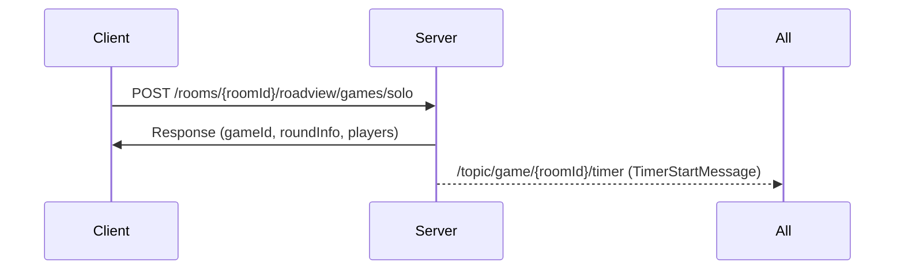

# 로드뷰 개인전 WebSocket 명세

> 프론트엔드 연동을 위한 WebSocket STOMP 채널 및 메시지 상세 명세서

## 📋 목차
1. [WebSocket 연결 설정](#1-websocket-연결-설정)
2. [구독해야 할 채널 목록](#2-구독해야-할-채널-목록)
3. [메시지 포맷 상세](#3-메시지-포맷-상세)
4. [게임 플로우별 메시지](#4-게임-플로우별-메시지)
5. [클라이언트 구현 예제](#5-클라이언트-구현-예제)

---

## 1. WebSocket 연결 설정

### 1.1 연결 엔드포인트
```
ws://your-domain.com/ws
```

**프로토콜:** STOMP over SockJS

### 1.2 연결 헤더
```javascript
const headers = {
  'Authorization': 'Bearer {your_jwt_token}'
};
```

### 1.3 STOMP 설정
- **Application Prefix:** `/app` (클라이언트 → 서버 메시지)
- **Broker Prefix:** `/topic` (브로드캐스트), `/queue` (개인 메시지)
- **User Prefix:** `/user` (개인 메시지)

---

## 2. 구독해야 할 채널 목록

### 2.1 게임방 관련 채널

#### 📌 게임방 플레이어 목록
```
/topic/room/{roomId}/playerList
```
**용도:** 플레이어 입장/퇴장 알림

**메시지 예시:**
```json
{
  "type": "PLAYER_JOINED",
  "player": {
    "playerId": 123,
    "nickname": "플레이어1",
    "isHost": false
  },
  "currentPlayers": 3
}
```

#### 📌 게임방 채팅
```
/topic/room/{roomId}/chat
```
**용도:** 게임방 채팅 메시지

**메시지 예시:**
```json
{
  "senderId": 123,
  "senderNickname": "플레이어1",
  "message": "안녕하세요!",
  "timestamp": 1698765432000
}
```

#### 📌 게임방 상태 변경
```
/topic/room/{roomId}/status
```
**용도:** 게임방 설정 변경, 게임 시작 등 상태 변경

**메시지 예시:**
```json
{
  "type": "GAME_STARTED",
  "roomStatus": "PLAYING",
  "gameId": 100
}
```

---

### 2.2 게임 진행 관련 채널

#### 📌 타이머 시작 (라운드 시작)
```
/topic/game/{roomId}/timer
```
**용도:** 라운드 타이머 시작 알림

**메시지 예시:**
```json
{
  "roundId": "1001",
  "gameMode": "ROADVIEW",
  "serverStartTimeMs": 1698765432000,
  "durationMs": 60000,
  "serverTimestamp": 1698765432000
}
```

**필드 설명:**
- `roundId`: 라운드 ID
- `gameMode`: 게임 모드 (ROADVIEW, PHOTO)
- `serverStartTimeMs`: 서버 타이머 시작 시각 (epoch ms)
- `durationMs`: 타이머 지속 시간 (밀리초)
- `serverTimestamp`: 현재 서버 타임스탬프

**클라이언트 동기화:**
```javascript
const startTime = message.serverStartTimeMs;
const duration = message.durationMs;
const serverTime = message.serverTimestamp;
const clientTime = Date.now();
const timeDiff = serverTime - clientTime; // 서버-클라 시간차

// 남은 시간 계산
const elapsed = (Date.now() + timeDiff) - startTime;
const remaining = Math.max(0, duration - elapsed);
```

#### 📌 라운드 결과
```
/topic/game/{roomId}/round/result
```
**용도:** 라운드 종료 시 모든 플레이어의 결과 브로드캐스트

**메시지 예시:**
```json
{
  "roundNumber": 1,
  "targetLat": 37.5665,
  "targetLng": 126.9780,
  "playerSubmissionResults": [
    {
      "lat": 37.5670,
      "lng": 126.9785,
      "distance": 123.45,
      "timeToAnswer": 45230.5,
      "earnedScore": 8500
    }
  ],
  "playerTotalResults": [
    {
      "playerId": 201,
      "nickname": "플레이어1",
      "markerImageUrl": "https://example.com/marker1.png",
      "totalScore": 8500,
      "roundRank": 1
    },
    {
      "playerId": 202,
      "nickname": "플레이어2",
      "markerImageUrl": "https://example.com/marker2.png",
      "totalScore": 7200,
      "roundRank": 2
    }
  ]
}
```

**필드 설명:**
- `roundNumber`: 라운드 번호
- `targetLat`, `targetLng`: 정답 좌표
- `playerSubmissionResults`: 각 플레이어의 제출 결과
  - `lat`, `lng`: 플레이어가 제출한 좌표
  - `distance`: 정답과의 거리 (미터)
  - `timeToAnswer`: 응답 시간 (밀리초)
  - `earnedScore`: 이번 라운드에서 획득한 점수
- `playerTotalResults`: 누적 점수 및 순위
  - `totalScore`: 현재까지 누적 점수
  - `roundRank`: 현재 전체 순위

#### 📌 라운드 전환 타이머 (10초 대기)
```
/topic/game/{roomId}/round/transition
```
**용도:** 라운드 결과 확인 후 다음 라운드 시작까지 대기

**메시지 예시:**
```json
{
  "nextRoundStartTimeMs": 1698765442000,
  "serverTimestamp": 1698765432000,
  "isLastRound": false
}
```

**필드 설명:**
- `nextRoundStartTimeMs`: 다음 라운드 시작 시각 (epoch ms)
- `serverTimestamp`: 현재 서버 타임스탬프
- `isLastRound`: 마지막 라운드 여부

**클라이언트 카운트다운:**
```javascript
const nextStartTime = message.nextRoundStartTimeMs;
const serverTime = message.serverTimestamp;
const clientTime = Date.now();
const timeDiff = serverTime - clientTime;

// 남은 시간 계산
const remaining = nextStartTime - (Date.now() + timeDiff);
const seconds = Math.ceil(remaining / 1000); // 초 단위 카운트다운
```

#### 📌 다음 라운드 시작
```
/topic/game/{roomId}/round/start
```
**용도:** 새 라운드 시작 알림 및 문제 정보

**메시지 예시:**
```json
{
  "gameId": 100,
  "currentRound": 2,
  "roundInfo": {
    "roundId": 1002,
    "roundNumber": 2,
    "targetLat": 35.1796,
    "targetLng": 129.0756
  }
}
```

**동작:**
- 이 메시지를 받으면 새 라운드 UI로 전환
- `roundInfo`의 좌표로 새 로드뷰 문제 표시
- 동시에 `/topic/game/{roomId}/timer` 채널로 타이머 시작 메시지 수신

#### 📌 정답 제출 알림
```
/topic/game/{gameId}/roadview/submissions/player
```
**용도:** 다른 플레이어가 정답을 제출했을 때 실시간 알림

**메시지 예시:**
```json
{
  "playerId": 202,
  "roundId": 1001,
  "timestamp": "2024-10-31T12:34:56.789Z"
}
```

**용도:**
- "플레이어 2가 제출했습니다" UI 표시
- 제출한 플레이어 수 카운트 (예: "3/5명 제출 완료")

#### 📌 게임 종료
```
/topic/game/{roomId}/game/finished
```
**용도:** 모든 라운드 완료 후 게임 종료 알림

**메시지 예시:**
```json
{
  "gameId": 100,
  "message": "게임이 종료되었습니다.",
  "timestamp": 1698765532000
}
```

---

### 2.3 개인 메시지 채널

#### 📌 개인 알림
```
/user/{memberId}/notification
```
**용도:** 개인에게만 전송되는 알림

**메시지 예시:**
```json
{
  "type": "KICKED",
  "message": "방장에 의해 강퇴되었습니다.",
  "timestamp": 1698765432000
}
```

---

## 3. 메시지 포맷 상세

### 3.1 타이머 메시지 종류

#### TimerStartMessage
게임 라운드 시작 시 전송
```typescript
interface TimerStartMessage {
  roundId: string;
  gameMode: 'ROADVIEW' | 'PHOTO';
  serverStartTimeMs: number;  // 서버 타이머 시작 시각
  durationMs: number;          // 타이머 지속 시간
  serverTimestamp: number;     // 현재 서버 시간
}
```

#### TimerSyncMessage
타이머 동기화 메시지 (주기적 전송)
```typescript
interface TimerSyncMessage {
  roundId: string;
  remainingTimeMs: number;     // 남은 시간
  serverTimestamp: number;     // 현재 서버 시간
  isFinalCountDown: boolean;   // 마지막 10초 여부
}
```

#### RoundTransitionTimerMessage
라운드 전환 대기 타이머
```typescript
interface RoundTransitionTimerMessage {
  nextRoundStartTimeMs: number; // 다음 라운드 시작 시각
  serverTimestamp: number;       // 현재 서버 시간
  isLastRound: boolean;          // 마지막 라운드 여부
}
```

### 3.2 게임 진행 메시지

#### RoundResult (PlayerResult)
```typescript
interface RoundResult {
  roundNumber: number;
  targetLat: number;
  targetLng: number;
  playerSubmissionResults: SubmissionResult[];
  playerTotalResults: PlayerResult[];
}

interface SubmissionResult {
  lat: number;
  lng: number;
  distance: number;        // 미터
  timeToAnswer: number;    // 밀리초
  earnedScore: number;
}

interface PlayerResult {
  playerId: number;
  nickname: string;
  markerImageUrl: string;
  totalScore: number;
  roundRank: number;
}
```

#### NextRoundInfo
```typescript
interface NextRoundInfo {
  gameId: number;
  currentRound: number;
  roundInfo: {
    roundId: number;
    roundNumber: number;
    targetLat: number;
    targetLng: number;
  };
}
```

#### PlayerSubmissionMessage
```typescript
interface PlayerSubmissionMessage {
  playerId: number;
  roundId: number;
  timestamp: string; // ISO 8601
}
```

#### GameFinishedMessage
```typescript
interface GameFinishedMessage {
  gameId: number;
  message: string;
  timestamp: number;
}
```

---

## 4. 게임 플로우별 메시지

### 4.1 게임 시작 플로우



**수신 순서:**
1. REST API 응답: 게임 기본 정보 (gameId, roundInfo)
2. WebSocket `/topic/game/{roomId}/timer`: 타이머 시작

### 4.2 라운드 진행 플로우

```
1. 플레이어가 정답 제출
   → POST /rooms/{roomId}/games/{gameId}/rounds/{roundId}/submissions/player
   
2. 제출 알림 (실시간)
   → /topic/game/{gameId}/roadview/submissions/player
   
3. 타이머 종료 또는 모든 플레이어 제출 완료
   → 라운드 자동 종료
   
4. 라운드 결과 브로드캐스트
   → /topic/game/{roomId}/round/result
   
5. 라운드 전환 타이머 시작 (10초)
   → /topic/game/{roomId}/round/transition
   
6a. 마지막 라운드가 아닌 경우:
   → /topic/game/{roomId}/round/start (다음 라운드 시작)
   → /topic/game/{roomId}/timer (타이머 시작)
   
6b. 마지막 라운드인 경우:
   → /topic/game/{roomId}/game/finished (게임 종료)
```

### 4.3 조기 종료 플로우

모든 플레이어가 제출을 완료하면 타이머를 기다리지 않고 즉시 라운드 종료:

```
1. 마지막 플레이어 제출
   → POST .../submissions/player
   
2. 제출 알림
   → /topic/game/{gameId}/roadview/submissions/player
   
3. 조기 종료 감지 (서버)
   → 타이머 즉시 중단
   
4. 라운드 결과 즉시 브로드캐스트
   → /topic/game/{roomId}/round/result
   
5. 이후 정상 플로우 진행
```

---

## 5. 클라이언트 구현 예제

### 5.1 SockJS + STOMP 연결

```javascript
import SockJS from 'sockjs-client';
import { Client } from '@stomp/stompjs';

class GameWebSocket {
  constructor(token) {
    this.token = token;
    this.client = null;
    this.subscriptions = new Map();
  }

  connect(onConnected) {
    const socket = new SockJS('http://your-domain.com/ws');
    
    this.client = new Client({
      webSocketFactory: () => socket,
      connectHeaders: {
        'Authorization': `Bearer ${this.token}`
      },
      debug: (str) => console.log(str),
      reconnectDelay: 5000,
      heartbeatIncoming: 4000,
      heartbeatOutgoing: 4000,
      onConnect: (frame) => {
        console.log('Connected:', frame);
        onConnected();
      },
      onStompError: (frame) => {
        console.error('STOMP error:', frame);
      }
    });

    this.client.activate();
  }

  disconnect() {
    if (this.client) {
      this.client.deactivate();
    }
  }

  subscribe(destination, callback) {
    if (!this.client || !this.client.connected) {
      console.error('Client is not connected');
      return;
    }

    const subscription = this.client.subscribe(destination, (message) => {
      const data = JSON.parse(message.body);
      callback(data);
    });

    this.subscriptions.set(destination, subscription);
    return subscription;
  }

  unsubscribe(destination) {
    const subscription = this.subscriptions.get(destination);
    if (subscription) {
      subscription.unsubscribe();
      this.subscriptions.delete(destination);
    }
  }

  send(destination, body) {
    if (!this.client || !this.client.connected) {
      console.error('Client is not connected');
      return;
    }

    this.client.publish({
      destination,
      body: JSON.stringify(body)
    });
  }
}

export default GameWebSocket;
```

### 5.2 게임 구독 설정

```javascript
class RoadViewGameClient {
  constructor(ws, roomId) {
    this.ws = ws;
    this.roomId = roomId;
    this.gameId = null;
    this.currentRound = null;
  }

  subscribeToGameChannels() {
    // 타이머 구독
    this.ws.subscribe(`/topic/game/${this.roomId}/timer`, (message) => {
      this.onTimerStart(message);
    });

    // 라운드 결과 구독
    this.ws.subscribe(`/topic/game/${this.roomId}/round/result`, (message) => {
      this.onRoundResult(message);
    });

    // 라운드 전환 타이머 구독
    this.ws.subscribe(`/topic/game/${this.roomId}/round/transition`, (message) => {
      this.onRoundTransition(message);
    });

    // 다음 라운드 시작 구독
    this.ws.subscribe(`/topic/game/${this.roomId}/round/start`, (message) => {
      this.onNextRoundStart(message);
    });

    // 게임 종료 구독
    this.ws.subscribe(`/topic/game/${this.roomId}/game/finished`, (message) => {
      this.onGameFinished(message);
    });
  }

  subscribeToSubmissions(gameId) {
    this.gameId = gameId;
    
    // 제출 알림 구독
    this.ws.subscribe(`/topic/game/${gameId}/roadview/submissions/player`, (message) => {
      this.onPlayerSubmitted(message);
    });
  }

  onTimerStart(message) {
    console.log('Timer started:', message);
    
    const { serverStartTimeMs, durationMs, serverTimestamp } = message;
    const timeDiff = serverTimestamp - Date.now();
    
    // 타이머 UI 시작
    this.startTimer(serverStartTimeMs, durationMs, timeDiff);
  }

  onRoundResult(message) {
    console.log('Round result:', message);
    
    // 결과 화면 표시
    this.showRoundResult(message);
  }

  onRoundTransition(message) {
    console.log('Round transition:', message);
    
    const { nextRoundStartTimeMs, serverTimestamp, isLastRound } = message;
    const timeDiff = serverTimestamp - Date.now();
    
    if (isLastRound) {
      console.log('This was the last round!');
    } else {
      // 10초 카운트다운 표시
      this.startTransitionCountdown(nextRoundStartTimeMs, timeDiff);
    }
  }

  onNextRoundStart(message) {
    console.log('Next round started:', message);
    
    const { gameId, currentRound, roundInfo } = message;
    this.currentRound = roundInfo;
    
    // 새 라운드 UI 표시
    this.showNewRound(roundInfo);
  }

  onPlayerSubmitted(message) {
    console.log('Player submitted:', message);
    
    // "플레이어 X가 제출했습니다" UI 표시
    this.showSubmissionNotification(message.playerId);
  }

  onGameFinished(message) {
    console.log('Game finished:', message);
    
    // 게임 종료 화면 표시
    this.showGameFinished(message);
  }

  startTimer(startTime, duration, timeDiff) {
    const interval = setInterval(() => {
      const now = Date.now() + timeDiff;
      const elapsed = now - startTime;
      const remaining = Math.max(0, duration - elapsed);
      
      if (remaining <= 0) {
        clearInterval(interval);
        console.log('Time is up!');
      }
      
      // UI 업데이트
      this.updateTimerUI(remaining);
    }, 100);
  }

  startTransitionCountdown(nextStartTime, timeDiff) {
    const interval = setInterval(() => {
      const now = Date.now() + timeDiff;
      const remaining = Math.max(0, nextStartTime - now);
      const seconds = Math.ceil(remaining / 1000);
      
      if (remaining <= 0) {
        clearInterval(interval);
      }
      
      // UI 업데이트 (10...9...8...)
      this.updateCountdownUI(seconds);
    }, 100);
  }

  // UI 업데이트 함수들 (구현 필요)
  updateTimerUI(remaining) { }
  updateCountdownUI(seconds) { }
  showRoundResult(result) { }
  showNewRound(roundInfo) { }
  showSubmissionNotification(playerId) { }
  showGameFinished(message) { }
}
```

### 5.3 게임 시작 및 정답 제출

```javascript
// 게임 시작
async function startGame(roomId, gameSettings) {
  const response = await fetch(`/rooms/${roomId}/roadview/games/solo`, {
    method: 'POST',
    headers: {
      'Content-Type': 'application/json',
      'Authorization': `Bearer ${token}`
    },
    body: JSON.stringify({
      gameRoomId: roomId,
      playerMatchTypeKey: 'SOLO',
      totalRounds: gameSettings.totalRounds,
      timeLimit: gameSettings.timeLimit
    })
  });

  const data = await response.json();
  
  if (data.isSuccess) {
    const { gameId, roundInfo, gamePlayers } = data.result;
    
    // 제출 알림 구독
    gameClient.subscribeToSubmissions(gameId);
    
    // 게임 UI 초기화
    initializeGame(gameId, roundInfo, gamePlayers);
  }
}

// 정답 제출
async function submitAnswer(roomId, gameId, roundId, lat, lng, timeToAnswer) {
  const response = await fetch(
    `/rooms/${roomId}/games/${gameId}/rounds/${roundId}/submissions/player`,
    {
      method: 'POST',
      headers: {
        'Content-Type': 'application/json',
        'Authorization': `Bearer ${token}`
      },
      body: JSON.stringify({
        lat,
        lng,
        timeToAnswer
      })
    }
  );

  const data = await response.json();
  
  if (data.isSuccess) {
    console.log('Submission successful');
    // 제출 완료 UI 표시
    showSubmissionConfirmation();
  }
}
```

---

## 6. 주요 참고사항

### 6.1 시간 동기화
- 서버와 클라이언트의 시간차를 계산하여 타이머 동기화
- `serverTimestamp`를 기준으로 클라이언트 시간 보정

```javascript
const timeDiff = message.serverTimestamp - Date.now();
const syncedTime = Date.now() + timeDiff;
```

### 6.2 재연결 처리
- 연결이 끊겼을 때 자동 재연결
- 재연결 후 모든 채널 재구독
- 현재 게임 상태 복구

### 6.3 에러 처리
- WebSocket 연결 실패
- 구독 실패
- 메시지 파싱 오류

### 6.4 메모리 관리
- 게임 종료 시 모든 구독 해제
- 타이머 interval 정리
- 이벤트 리스너 제거

---

## 7. 다음 문서

- [REST API 가이드](./ROADVIEW_SOLO_API_GUIDE.md) - REST API 상세 명세
- [통합 플로우 가이드](./ROADVIEW_SOLO_INTEGRATION_FLOW.md) - 전체 게임 플로우 및 프론트엔드 연동 예제

