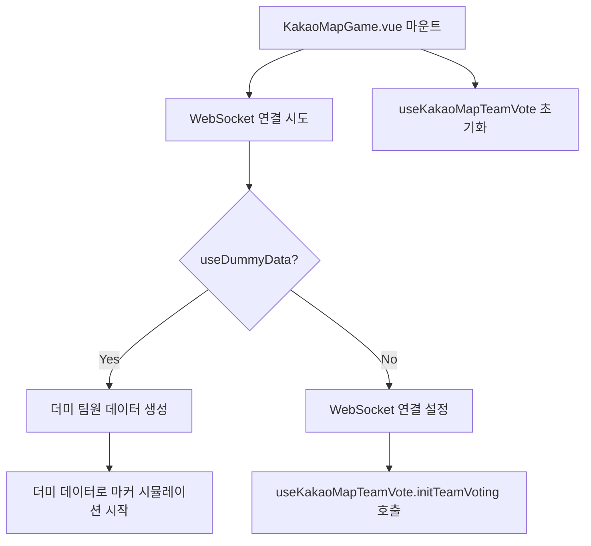
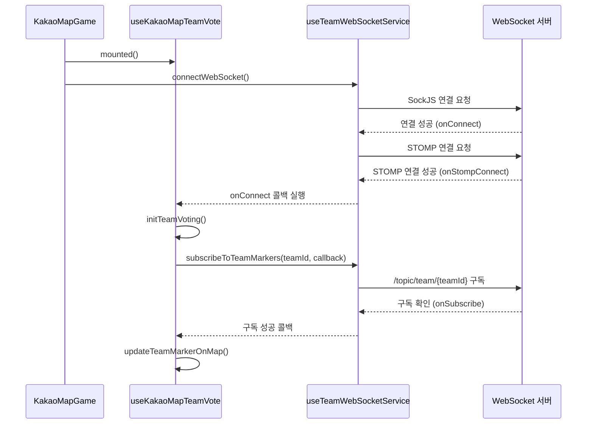
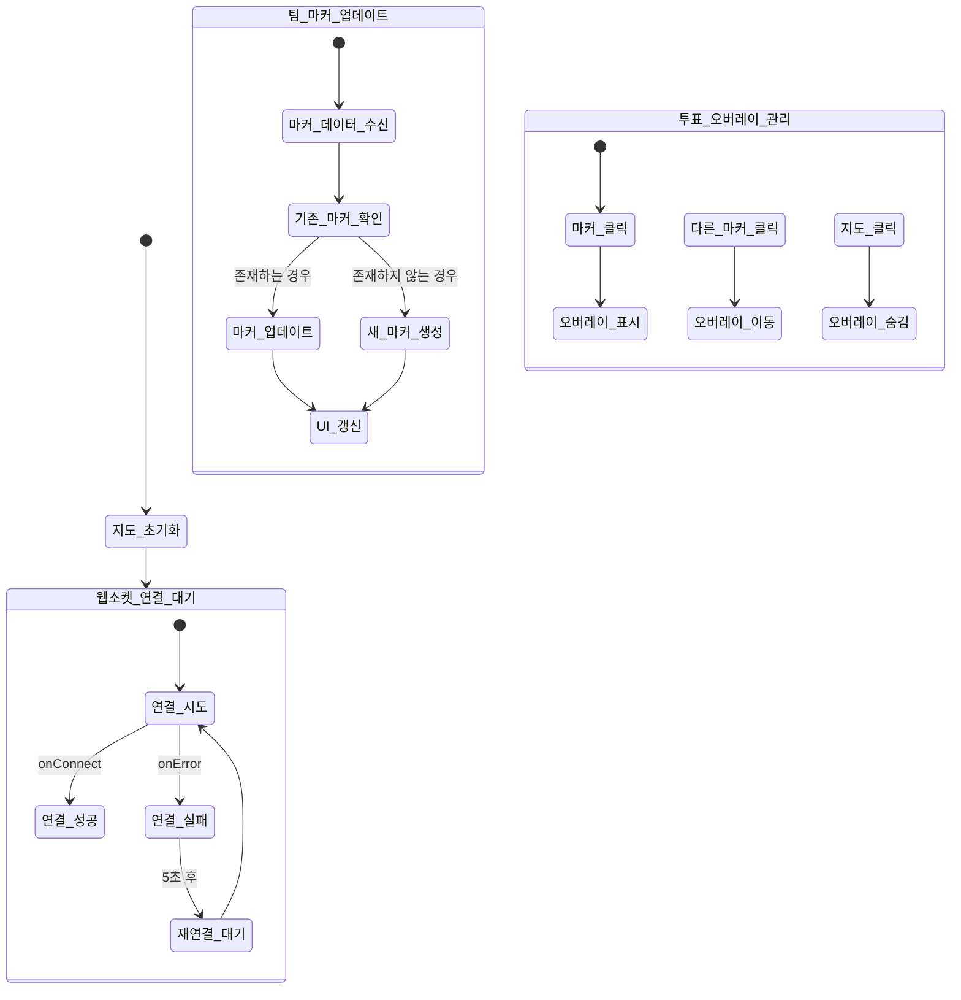

# KoSpot 팀 투표 시스템 아키텍처

## 개요
KoSpot의 팀 투표 시스템은 실시간으로 팀원들의 위치를 공유하고 투표할 수 있는 기능을 제공합니다. WebSocket을 사용하여 실시간 통신을 구현했으며, 백엔드 서버가 없는 환경에서도 테스트할 수 있도록 더미 데이터 모드를 지원합니다.

## 주요 컴포넌트 구조

### 1. KakaoMapGame.vue
- 팀 투표 기능이 통합된 지도 컴포넌트
- 팀원들의 마커를 표시하고 이벤트를 처리하는 컨테이너 역할

### 2. useKakaoMapTeamVote.js
- 팀 투표 관련 로직을 캡슐화한 컴포저블
- WebSocket 서비스와의 통신을 담당
- 팀원 마커 관리 및 이벤트 핸들링

### 3. useTeamWebSocketService.js
- WebSocket 연결 및 통신을 담당하는 서비스 레이어
- STOMP 프로토콜을 사용한 실시간 메시지 브로커와 통신
- 더미 데이터 모드 지원

### 4. useKakaoMapState.js
- 지도와 관련된 상태를 중앙에서 관리
- 팀 마커 상태(teamMarkers)를 포함한 모든 지도 관련 상태 관리

## 데이터 흐름

### 1. 초기화 단계


### 2. WebSocket 연결 프로세스


### 3. 팀 마커 업데이트 흐름
```mermaid
flowchart LR
    A[사용자 지도 클릭] --> B[handleMapClick 이벤트]
    B --> C[shareTeamMarker(position) 호출]
    C --> D[createOrUpdateTeamMarker 호출]
    D --> E[teamMarkers 상태 업데이트]
    C --> F[WebSocketService.sendTeamMarker 호출]
    F --> G[STOMP 메시지 전송]
    G --> H[서버에서 팀 채널로 브로드캐스트]
    H --> I[다른 클라이언트의 handleTeamMarkerReceived 호출]
    I --> J[updateTeamMarkerOnMap 호출]
    J --> K[teamMarkers 상태 업데이트]
    K --> L[지도에 마커 렌더링]
```

### 4. 컴포넌트 생명주기별 메서드 호출 순서
```
KakaoMapGame mounted()
  ↓
connectWebSocket()
  ↓
useKakaoMapTeamVote()
  ├─ initTeamVoting()
  │  ├─ subscribeToTeamMarkers()
  │  └─ updateTeamMarkerOnMap()
  └─ setupEventListeners()

handleMapClick(position)
  ↓
shareTeamMarker(position)
  ├─ createOrUpdateTeamMarker()
  │  └─ updateTeamMarkersState()
  └─ sendTeamMarker()
    └─ stompClient.publish()

handleTeamMarkerReceived(message)
  ↓
updateTeamMarkerOnMap()
  ├─ createOrUpdateTeamMarker()
  └─ updateVoteOverlay()

beforeUnmount()
  ↓
cleanupTeamMarkers()
  ├─ removeAllTeamMarkers()
  └─ disconnectWebSocket()
```

### 5. 상태 업데이트 흐름


## 주요 메서드 상세

### useKakaoMapTeamVote.js
- `initTeamVoting()`: 팀 투표 시스템 초기화
- `shareTeamMarker(position)`: 현재 플레이어의 마커 위치 공유
- `handleTeamMarkerReceived(message)`: 팀원의 마커 업데이트 처리
- `updateTeamMarkerOnMap()`: 지도에 팀원 마커 업데이트
- `cleanupTeamMarkers()`: 팀 마커 정리

### useTeamWebSocketService.js
- `connectWebSocket()`: WebSocket 연결 설정
- `disconnectWebSocket()`: WebSocket 연결 해제
- `subscribeToTeamMarkers(teamId, callback)`: 팀 채널 구독
- `sendTeamMarker(teamId, markerData)`: 팀 마커 데이터 전송
- `simulateSendMarker()`: 더미 데이터 모드에서 마커 시뮬레이션

## 상태 관리

### useKakaoMapState.js
```javascript
// 팀 마커 상태
const teamMarkers = ref([]); // { id, position, nickname, markerImage, teamId }[]
```

### useTeamWebSocketService.js
```javascript
// 현재 플레이어 정보
const currentPlayer = ref({
    id: string,
    nickname: string,
    markerImage: string,
    teamId: string
});
```

## 더미 데이터 모드
- `useDummyData` 플래그가 true일 때 활성화
- 백엔드 서버 없이도 팀원 마커 테스트 가능
- 랜덤한 위치로 주기적으로 마커 업데이트 시뮬레이션

## 에러 처리
- WebSocket 연결 실패 시 자동 재연결 시도
- 메시지 전송 실패 시 콘솔에 에러 로깅
- 더미 데이터 모드에서의 오류 방지를 위한 유효성 검사

## 성능 최적화
- 불필요한 리렌더링 방지를 위한 메모이제이션
- 이벤트 리스너의 메모리 누수 방지를 위한 클린업
- 대량의 마커 업데이트 시 성능을 위한 배치 처리

## 사용 예시
```javascript
// 컴포넌트에서 사용 예시
const { 
  teamMarkers,
  shareTeamMarker,
  cleanupTeamMarkers 
} = useKakaoMapTeamVote(props, emit);

// 마커 클릭 핸들러
const handleMapClick = (position) => {
  shareTeamMarker(position);
};

// 컴포넌트 언마운트 시 정리
onBeforeUnmount(() => {
  cleanupTeamMarkers();
});
```

## 주의사항
- WebSocket 연결은 반드시 컴포넌트 언마운트 시 정리해야 함
- 더미 데이터 모드는 개발용으로만 사용해야 함
- 실제 배포 시에는 반드시 `useDummyData`를 false로 설정해야 함
